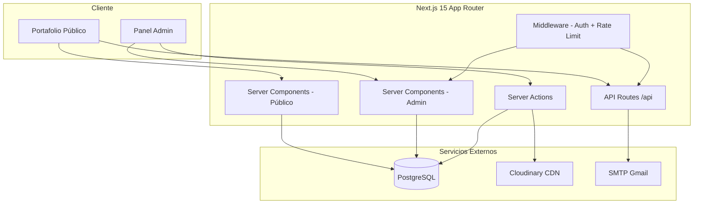
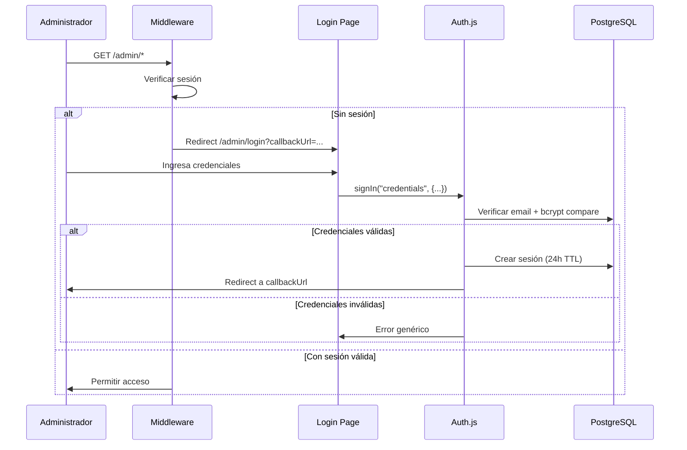
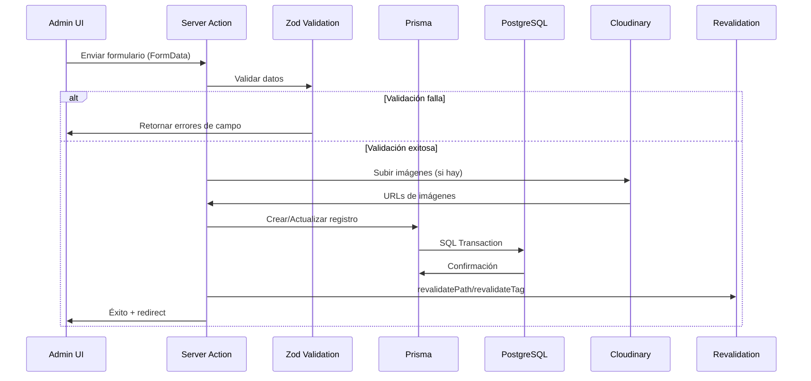

# Design Document: Portfolio Admin CMS

## Overview

Este diseño transforma el portafolio estático de Juan Carlos Echeverri Avalúos en un sistema CMS completo con panel de administración. La arquitectura actual tiene todo el contenido hardcodeado en archivos TypeScript (`data.ts`, `data_experience.tsx`), usa Next.js 14 con Pages/App Router híbrido, React 18, Tailwind CSS 3, y varias dependencias obsoletas (react-reveal, react-hot-toast duplicado con Radix Toast).

La nueva arquitectura implementa:
- **Panel de administración** protegido con autenticación basada en sesiones
- **Base de datos PostgreSQL** con Prisma ORM para persistencia de contenido
- **Almacenamiento en la nube** (Cloudinary) para gestión de medios con optimización automática
- **Portafolio público modernizado** con animaciones, dark mode, responsive design y SEO dinámico
- **Actualización del stack** a Next.js 15, React 19, Tailwind CSS 4, Framer Motion 11+

### Decisiones Clave de Diseño

| Decisión | Elección | Justificación |
|----------|----------|---------------|
| Autenticación | NextAuth.js v5 (Auth.js) | Integración nativa con Next.js 15 App Router, soporte de sesiones en DB |
| ORM | Prisma | Requerido por requisitos, tipado fuerte, migraciones versionadas |
| Base de datos | PostgreSQL | Requerido por requisitos, robusto para datos relacionales |
| Almacenamiento | Cloudinary | CDN integrado, transformaciones de imagen automáticas (thumbnail/medium/large), SDK para Next.js |
| UI Admin | shadcn/ui + Radix UI | Ya parcialmente en uso (Radix Dialog, Label, Toast), consistente y accesible |
| Animaciones | Framer Motion 11+ | Reemplaza react-reveal (sin mantenimiento) y react-awesome-reveal, compatible con React 19 |
| Formularios | React Hook Form + Zod | Ya en uso, validación tipada client/server |
| Email | Nodemailer (existente) | Ya configurado, funcional para notificaciones |
| Rate Limiting | upstash/ratelimit | Serverless-compatible, para proteger login y formulario de contacto |

## Architecture

### Diagrama de Alto Nivel



### Estructura de Directorios

```
src/
├── app/
│   ├── (public)/              # Grupo de rutas públicas
│   │   ├── layout.tsx         # Layout público con navbar, footer
│   │   ├── page.tsx           # Home con hero, servicios, proyectos
│   │   ├── projects/
│   │   │   └── [slug]/page.tsx
│   │   ├── services/page.tsx
│   │   ├── experience/page.tsx
│   │   └── contact/page.tsx
│   ├── admin/                 # Panel de administración
│   │   ├── layout.tsx         # Layout admin con sidebar
│   │   ├── page.tsx           # Dashboard
│   │   ├── login/page.tsx     # Login (sin layout admin)
│   │   ├── projects/
│   │   │   ├── page.tsx       # Lista de proyectos
│   │   │   ├── new/page.tsx   # Crear proyecto
│   │   │   └── [id]/edit/page.tsx
│   │   ├── services/page.tsx
│   │   ├── experience/page.tsx
│   │   ├── profile/page.tsx
│   │   ├── statistics/page.tsx
│   │   ├── testimonials/page.tsx
│   │   ├── media/page.tsx
│   │   └── messages/page.tsx
│   ├── api/
│   │   ├── auth/[...nextauth]/route.ts
│   │   ├── contact/route.ts
│   │   ├── upload/route.ts
│   │   └── revalidate/route.ts
│   ├── layout.tsx             # Root layout
│   ├── globals.css
│   └── sitemap.ts             # Sitemap dinámico
├── components/
│   ├── public/                # Componentes del portafolio público
│   ├── admin/                 # Componentes del panel admin
│   └── ui/                    # shadcn/ui components
├── lib/
│   ├── prisma.ts              # Singleton Prisma Client
│   ├── auth.ts                # Configuración Auth.js
│   ├── validations/           # Schemas Zod compartidos
│   ├── actions/               # Server Actions por entidad
│   ├── cloudinary.ts          # Configuración Cloudinary
│   └── utils.ts               # Utilidades generales
├── prisma/
│   ├── schema.prisma
│   ├── migrations/
│   └── seed.ts
└── middleware.ts              # Auth guard + rate limiting
```

### Flujo de Autenticación



### Flujo de Gestión de Contenido



## Components and Interfaces

### Server Actions (lib/actions/)

```typescript
// lib/actions/projects.ts
export async function createProject(formData: FormData): Promise<ActionResult<Project>>
export async function updateProject(id: string, formData: FormData): Promise<ActionResult<Project>>
export async function deleteProject(id: string): Promise<ActionResult<void>>
export async function reorderProjects(orderedIds: string[]): Promise<ActionResult<void>>
export async function toggleProjectStatus(id: string, status: 'published' | 'draft'): Promise<ActionResult<Project>>

// lib/actions/services.ts
export async function createService(formData: FormData): Promise<ActionResult<Service>>
export async function updateService(id: string, formData: FormData): Promise<ActionResult<Service>>
export async function deleteService(id: string): Promise<ActionResult<void>>
export async function reorderServices(orderedIds: string[]): Promise<ActionResult<void>>

// lib/actions/experience.ts
export async function createExperience(formData: FormData): Promise<ActionResult<Experience>>
export async function updateExperience(id: string, formData: FormData): Promise<ActionResult<Experience>>
export async function deleteExperience(id: string): Promise<ActionResult<void>>

// lib/actions/profile.ts
export async function updateProfile(formData: FormData): Promise<ActionResult<Profile>>

// lib/actions/statistics.ts
export async function createStatistic(formData: FormData): Promise<ActionResult<Statistic>>
export async function updateStatistic(id: string, formData: FormData): Promise<ActionResult<Statistic>>
export async function deleteStatistic(id: string): Promise<ActionResult<void>>

// lib/actions/testimonials.ts
export async function createTestimonial(formData: FormData): Promise<ActionResult<Testimonial>>
export async function updateTestimonial(id: string, formData: FormData): Promise<ActionResult<Testimonial>>
export async function deleteTestimonial(id: string): Promise<ActionResult<void>>
export async function toggleTestimonialStatus(id: string, status: 'published' | 'draft'): Promise<ActionResult<Testimonial>>

// lib/actions/media.ts
export async function uploadMedia(formData: FormData): Promise<ActionResult<Media>>
export async function deleteMedia(id: string): Promise<ActionResult<void>>
export async function getMediaUsage(id: string): Promise<ActionResult<MediaUsage[]>>

// lib/actions/messages.ts
export async function markMessageAsRead(id: string): Promise<ActionResult<void>>
export async function deleteMessage(id: string): Promise<ActionResult<void>>
```

### Tipos Compartidos

```typescript
// lib/types.ts
export type ActionResult<T> = 
  | { success: true; data: T }
  | { success: false; error: string; fieldErrors?: Record<string, string[]> }

export type PaginatedResult<T> = {
  items: T[]
  total: number
  page: number
  pageSize: number
  totalPages: number
}
```

### Schemas de Validación (lib/validations/)

```typescript
// lib/validations/project.ts
export const projectSchema = z.object({
  title: z.string().min(1).max(100),
  description: z.string().min(1).max(2000),
  status: z.enum(['published', 'draft']).default('draft'),
  order: z.number().int().min(0).optional(),
})

// lib/validations/service.ts
export const serviceSchema = z.object({
  title: z.string().min(1).max(100),
  shortDescription: z.string().min(1).max(200),
  detailedDescription: z.string().min(1).max(2000),
  iconSvg: z.string().min(1),
  order: z.number().int().min(0).optional(),
})

// lib/validations/experience.ts
export const experienceSchema = z.object({
  title: z.string().min(1).max(100),
  location: z.string().min(1).max(150),
  date: z.string().min(1), // formato "mes año" o rango
  description: z.string().min(1).max(500),
  category: z.enum(['Educación', 'Certificación', 'Trabajo']),
})

// lib/validations/profile.ts
export const profileSchema = z.object({
  fullName: z.string().min(1).max(100),
  professionalTitle: z.string().min(1).max(120),
  biography: z.string().min(1).max(2000),
  email: z.string().email().max(254),
  phone: z.string().max(20).optional(),
  address: z.string().max(200).optional(),
  whatsappLink: z.string().optional(),
  socialLinks: z.array(z.object({
    platform: z.string().min(1),
    url: z.string().url(),
  })).max(6).optional(),
})

// lib/validations/statistic.ts
export const statisticSchema = z.object({
  value: z.number().int().min(0).max(999999),
  label: z.string().min(1).max(50),
  order: z.number().int().min(0).optional(),
})

// lib/validations/testimonial.ts
export const testimonialSchema = z.object({
  clientName: z.string().min(1).max(100),
  clientRole: z.string().min(1).max(100),
  text: z.string().min(1).max(500),
  status: z.enum(['published', 'draft']).default('draft'),
})

// lib/validations/contact.ts
export const contactSchema = z.object({
  name: z.string().min(1).max(100),
  email: z.string().email().max(254),
  phone: z.string().max(20).optional(),
  subject: z.string().min(1).max(150),
  message: z.string().min(1).max(2000),
})

// lib/validations/auth.ts
export const loginSchema = z.object({
  email: z.string().email().max(254),
  password: z.string().min(8).max(128),
})
```

### Middleware

```typescript
// middleware.ts
// - Protege todas las rutas /admin/* excepto /admin/login
// - Verifica sesión Auth.js válida
// - Aplica rate limiting por IP en /admin/login (5 intentos / 15 min)
// - Aplica rate limiting por IP en /api/contact (5 mensajes / 15 min)
// - Redirige a /admin/login con callbackUrl si no autenticado
```

### Componentes Admin Principales

```typescript
// components/admin/sidebar.tsx - Navegación lateral con links a todas las secciones
// components/admin/data-table.tsx - Tabla reutilizable con paginación
// components/admin/confirm-dialog.tsx - Diálogo de confirmación para eliminaciones
// components/admin/image-upload.tsx - Componente de subida con preview y progreso
// components/admin/sortable-list.tsx - Lista con drag-and-drop (dnd-kit)
// components/admin/form-error.tsx - Mensajes de error de formulario
// components/admin/dashboard-card.tsx - Tarjeta de contador para dashboard
```

### Componentes Públicos Principales

```typescript
// components/public/hero-section.tsx - Video/imagen de fondo con CTA
// components/public/services-grid.tsx - Grid de servicios con modal de detalles
// components/public/projects-carousel.tsx - Carrusel de proyectos (embla-carousel)
// components/public/experience-timeline.tsx - Línea de tiempo vertical
// components/public/testimonials-section.tsx - Grid/carrusel según cantidad
// components/public/statistics-counter.tsx - Contadores animados
// components/public/contact-form.tsx - Formulario con validación
// components/public/theme-toggle.tsx - Toggle dark/light mode
// components/public/whatsapp-fab.tsx - Botón flotante WhatsApp
// components/public/section-animation.tsx - Wrapper de animación de entrada
```

## Data Models

### Prisma Schema

```prisma
generator client {
  provider = "prisma-client-js"
}

datasource db {
  provider = "postgresql"
  url      = env("DATABASE_URL")
}

model User {
  id            String    @id @default(cuid())
  email         String    @unique
  passwordHash  String
  name          String?
  sessions      Session[]
  createdAt     DateTime  @default(now())
  updatedAt     DateTime  @updatedAt
}

model Session {
  id           String   @id @default(cuid())
  sessionToken String   @unique
  userId       String
  expires      DateTime
  user         User     @relation(fields: [userId], references: [id], onDelete: Cascade)
}

model Profile {
  id                String       @id @default(cuid())
  fullName          String       @db.VarChar(100)
  professionalTitle String       @db.VarChar(120)
  biography         String       @db.VarChar(2000)
  profileImageUrl   String?
  email             String       @db.VarChar(254)
  phone             String?      @db.VarChar(20)
  address           String?      @db.VarChar(200)
  whatsappNumber    String?
  socialLinks       SocialLink[]
  createdAt         DateTime     @default(now())
  updatedAt         DateTime     @updatedAt
}

model SocialLink {
  id        String  @id @default(cuid())
  platform  String  @db.VarChar(50)
  url       String
  profileId String
  profile   Profile @relation(fields: [profileId], references: [id], onDelete: Cascade)
}

model Project {
  id          String         @id @default(cuid())
  title       String         @db.VarChar(100)
  slug        String         @unique
  description String         @db.VarChar(2000)
  status      ContentStatus  @default(DRAFT)
  order       Int            @default(0)
  images      ProjectImage[]
  createdAt   DateTime       @default(now())
  updatedAt   DateTime       @updatedAt
}

model ProjectImage {
  id        String  @id @default(cuid())
  url       String
  mediaId   String?
  media     Media?  @relation(fields: [mediaId], references: [id], onDelete: SetNull)
  projectId String
  project   Project @relation(fields: [projectId], references: [id], onDelete: Cascade)
  order     Int     @default(0)
}

model Service {
  id                  String   @id @default(cuid())
  title               String   @db.VarChar(100)
  shortDescription    String   @db.VarChar(200)
  detailedDescription String   @db.VarChar(2000)
  iconSvg             String
  order               Int      @default(0)
  createdAt           DateTime @default(now())
  updatedAt           DateTime @updatedAt
}

model Experience {
  id          String             @id @default(cuid())
  title       String             @db.VarChar(100)
  location    String             @db.VarChar(150)
  date        String             @db.VarChar(50)
  description String             @db.VarChar(500)
  category    ExperienceCategory
  sortDate    DateTime           // Para ordenamiento cronológico
  createdAt   DateTime           @default(now())
  updatedAt   DateTime           @updatedAt
}

model Statistic {
  id        String   @id @default(cuid())
  value     Int
  label     String   @db.VarChar(50)
  order     Int      @default(0)
  createdAt DateTime @default(now())
  updatedAt DateTime @updatedAt
}

model Testimonial {
  id              String        @id @default(cuid())
  clientName      String        @db.VarChar(100)
  clientRole      String        @db.VarChar(100)
  text            String        @db.VarChar(500)
  clientPhotoUrl  String?
  status          ContentStatus @default(DRAFT)
  createdAt       DateTime      @default(now())
  updatedAt       DateTime      @updatedAt
}

model Media {
  id            String         @id @default(cuid())
  filename      String
  url           String
  thumbnailUrl  String?
  mediumUrl     String?
  largeUrl      String?
  mimeType      String
  size          Int            // bytes
  type          MediaType
  cloudinaryId  String?
  projectImages ProjectImage[]
  createdAt     DateTime       @default(now())
  updatedAt     DateTime       @updatedAt
}

model ContactMessage {
  id        String        @id @default(cuid())
  name      String        @db.VarChar(100)
  email     String        @db.VarChar(254)
  phone     String?       @db.VarChar(20)
  subject   String        @db.VarChar(150)
  message   String        @db.VarChar(2000)
  status    MessageStatus @default(UNREAD)
  ipAddress String?
  createdAt DateTime      @default(now())
  updatedAt DateTime      @updatedAt
}

enum ContentStatus {
  PUBLISHED
  DRAFT
}

enum ExperienceCategory {
  EDUCACION
  CERTIFICACION
  TRABAJO
}

enum MediaType {
  IMAGE
  VIDEO
}

enum MessageStatus {
  READ
  UNREAD
}
```

### Relaciones Clave

- **Project → ProjectImage**: Un proyecto tiene 1-10 imágenes ordenadas
- **ProjectImage → Media**: Cada imagen de proyecto referencia opcionalmente un medio de la galería
- **Profile → SocialLink**: Un perfil tiene 0-6 enlaces sociales
- **User → Session**: Un usuario puede tener múltiples sesiones activas
- **Media → ProjectImage**: Un medio puede estar asociado a múltiples imágenes de proyecto (para detectar uso antes de eliminar)


## Correctness Properties

*A property is a characteristic or behavior that should hold true across all valid executions of a system—essentially, a formal statement about what the system should do. Properties serve as the bridge between human-readable specifications and machine-verifiable correctness guarantees.*

### Property 1: Content Entity Validation

*For any* content entity (project, service, experience, statistic, testimonial, or contact message), the system SHALL accept the data if and only if all required fields are present and within their specified character/value limits, and SHALL reject with field-specific errors otherwise.

**Validates: Requirements 2.2, 2.4, 3.2, 3.4, 4.2, 4.6, 5.5, 6.2, 6.3, 6.5, 8.1, 8.6, 13.4**

### Property 2: Content Update Round-Trip

*For any* valid content entity update (project, service, experience, profile, statistic, or testimonial), saving the data and then loading it back SHALL return values equivalent to what was saved.

**Validates: Requirements 2.3, 3.3, 4.3, 5.2, 5.4, 8.2**

### Property 3: Draft Content Exclusion

*For any* content entity with a status field (project or testimonial), if the status is 'draft', public-facing queries SHALL never include that entity in their results.

**Validates: Requirements 2.7, 8.5, 11.5**

### Property 4: Ordering Persistence

*For any* permutation of orderable entities (projects or services), after persisting the new order, subsequent queries SHALL return the entities in exactly that order.

**Validates: Requirements 2.6, 3.6**

### Property 5: Experience Chronological Ordering

*For any* set of experience entries in the database, public and admin queries SHALL always return them sorted by date in descending order (most recent first).

**Validates: Requirements 4.1, 4.5**

### Property 6: Media Upload Validation

*For any* file upload attempt, the system SHALL accept the file if and only if: (a) for images, the format is JPG, PNG, or WebP AND size ≤ 5MB; (b) for videos, the format is MP4 or WebM AND size ≤ 50MB. Files exceeding limits SHALL be rejected before any network transfer begins.

**Validates: Requirements 2.8, 2.9, 7.2, 7.3, 7.4, 16.4**

### Property 7: Media Usage Detection

*For any* media item referenced by one or more project images, attempting deletion SHALL report all projects that reference it before allowing the operation to proceed.

**Validates: Requirements 7.6**

### Property 8: Pagination Correctness

*For any* paginated collection of N items with page size 20, requesting page P SHALL return items at indices [(P-1)*20, min(P*20, N)) and correct total/totalPages metadata.

**Validates: Requirements 7.1, 13.6**

### Property 9: Seed Idempotency

*For any* number of seed script executions N ≥ 1, the database SHALL contain exactly the same set of records (no duplicates) as after a single execution.

**Validates: Requirements 9.6**

### Property 10: Authenticated Route Protection

*For any* admin route path (excluding /admin/login), accessing without a valid session SHALL redirect to /admin/login with the original path preserved as callbackUrl parameter.

**Validates: Requirements 1.5**

### Property 11: Rate Limiting Enforcement

*For any* IP address, after reaching the rate limit threshold (5 failed logins or 5 contact submissions within 15 minutes), subsequent requests from that IP SHALL be rejected until the window expires.

**Validates: Requirements 1.7, 13.7**

### Property 12: Metadata Generation with Constraints

*For any* public page, the generated metadata SHALL have title ≤ 60 characters and description ≤ 160 characters. If source content fields are empty, the system SHALL use default values derived from the profile name and description.

**Validates: Requirements 12.1, 12.5**

### Property 13: Sitemap Reflects Published Content

*For any* set of content with mixed published/draft statuses, the generated sitemap.xml SHALL contain URLs for all and only published content pages.

**Validates: Requirements 12.2**

### Property 14: Dashboard Counters Accuracy

*For any* database state, the dashboard counters SHALL exactly equal: count of projects with status PUBLISHED, count of services, count of messages with status UNREAD, and count of testimonials with status PUBLISHED.

**Validates: Requirements 14.1**

### Property 15: WhatsApp Link Format Validation

*For any* phone number string, the system SHALL accept it as a valid WhatsApp number if and only if it matches international format (country code + number, 10-15 digits total), and SHALL generate the correct wa.me link.

**Validates: Requirements 5.3**

### Property 16: Testimonial Text Truncation

*For any* testimonial text, if the character count exceeds 500, the public display SHALL show a truncated version with a truncation indicator; if ≤ 500 characters, it SHALL display the complete text.

**Validates: Requirements 11.1**

### Property 17: Avatar Initials Generation

*For any* client name without a photo, the system SHALL generate an avatar displaying the initials derived from the first letter of the first and last name components.

**Validates: Requirements 11.4**

### Property 18: Theme Preference Persistence

*For any* theme selection (light or dark), storing the preference in localStorage and then reading it back SHALL return the same theme value, and page reload SHALL apply the persisted theme.

**Validates: Requirements 10.7**

### Property 19: JSON-LD Schema Validity

*For any* profile data and set of services, the generated JSON-LD structured data SHALL be valid against schema.org Person and Service schemas respectively.

**Validates: Requirements 12.3**

### Property 20: Login Error Message Uniformity

*For any* combination of invalid credentials (wrong email, wrong password, non-existent email, both wrong), the error message returned SHALL always be identical and generic, never revealing which field caused the failure.

**Validates: Requirements 1.3**


## Error Handling

### Estrategia por Capa

| Capa | Tipo de Error | Manejo |
|------|---------------|--------|
| Validación (Client) | Campos inválidos | Zod schema validation en formularios, errores inline por campo |
| Validación (Server) | Datos inválidos en Server Actions | Re-validación con Zod, retorno de `fieldErrors` en `ActionResult` |
| Autenticación | Credenciales inválidas | Mensaje genérico, rate limiting por IP |
| Base de datos | Conexión perdida | Retry 3 veces con 2s intervalo, mensaje "servicio no disponible" |
| Base de datos | Constraint violation | Mensaje descriptivo (ej: "slug duplicado"), preservar datos del formulario |
| Base de datos | Transacción fallida | Rollback automático (Prisma transactions), no aplicar cambios parciales |
| Almacenamiento | Upload fallido | Mensaje de error, preservar archivo seleccionado, opción de reintentar |
| Almacenamiento | Formato/tamaño inválido | Rechazo inmediato client-side antes de transferencia |
| Email | Envío fallido | Log del error, almacenar mensaje en DB igualmente, notificar al admin en dashboard |
| Red | Timeout/desconexión | Mensaje "error de conexión", preservar datos, opción de reintentar |
| Rate Limiting | Límite excedido | Mensaje indicando tiempo de espera, HTTP 429 |

### Patrones de Implementación

```typescript
// Server Action pattern con manejo de errores
export async function createProject(formData: FormData): Promise<ActionResult<Project>> {
  try {
    // 1. Validación
    const parsed = projectSchema.safeParse(Object.fromEntries(formData))
    if (!parsed.success) {
      return { success: false, error: 'Validación fallida', fieldErrors: parsed.error.flatten().fieldErrors }
    }
    
    // 2. Operación en transacción
    const project = await prisma.$transaction(async (tx) => {
      const slug = generateSlug(parsed.data.title)
      return tx.project.create({ data: { ...parsed.data, slug } })
    })
    
    // 3. Revalidación de caché
    revalidatePath('/(public)/projects')
    revalidateTag('projects')
    
    return { success: true, data: project }
  } catch (error) {
    if (error instanceof Prisma.PrismaClientKnownRequestError) {
      if (error.code === 'P2002') {
        return { success: false, error: 'Ya existe un proyecto con ese título' }
      }
    }
    return { success: false, error: 'Error al guardar. Intente nuevamente.' }
  }
}
```

### Manejo de Conexión a Base de Datos

```typescript
// lib/prisma.ts - Singleton con retry logic
import { PrismaClient } from '@prisma/client'

const MAX_RETRIES = 3
const RETRY_DELAY_MS = 2000

const prismaClientSingleton = () => {
  return new PrismaClient({
    log: process.env.NODE_ENV === 'development' ? ['query', 'error', 'warn'] : ['error'],
  })
}

// Connection health check with retry
export async function withRetry<T>(operation: () => Promise<T>): Promise<T> {
  let lastError: Error | undefined
  for (let attempt = 1; attempt <= MAX_RETRIES; attempt++) {
    try {
      return await operation()
    } catch (error) {
      lastError = error as Error
      if (attempt < MAX_RETRIES) {
        await new Promise(resolve => setTimeout(resolve, RETRY_DELAY_MS))
      }
    }
  }
  throw lastError
}
```

## Testing Strategy

### Enfoque Dual: Unit Tests + Property-Based Tests

Este proyecto utiliza un enfoque dual de testing:
- **Property-Based Tests (PBT)**: Verifican propiedades universales con 100+ iteraciones de inputs generados
- **Unit Tests**: Verifican ejemplos específicos, edge cases y comportamiento de integración
- **Integration Tests**: Verifican flujos completos con base de datos y servicios externos

### Stack de Testing

| Herramienta | Propósito |
|-------------|-----------|
| Vitest | Test runner principal (compatible con Next.js 15) |
| fast-check | Property-based testing library |
| @testing-library/react | Testing de componentes React |
| MSW (Mock Service Worker) | Mocking de API calls |
| Prisma (test client) | Testing con base de datos en memoria o test DB |

### Configuración de Property-Based Tests

- **Mínimo 100 iteraciones** por property test
- Cada test referencia su propiedad del documento de diseño
- Formato de tag: `Feature: portfolio-admin-cms, Property {number}: {title}`

### Estructura de Tests

```
tests/
├── properties/           # Property-based tests
│   ├── validation.test.ts      # Property 1: Content validation
│   ├── round-trip.test.ts      # Property 2: Update round-trip
│   ├── content-status.test.ts  # Property 3: Draft exclusion
│   ├── ordering.test.ts        # Properties 4, 5: Ordering
│   ├── media.test.ts           # Properties 6, 7: Media validation
│   ├── pagination.test.ts      # Property 8: Pagination
│   ├── seed.test.ts            # Property 9: Seed idempotency
│   ├── auth.test.ts            # Properties 10, 11, 20: Auth & rate limiting
│   ├── seo.test.ts             # Properties 12, 13, 19: Metadata & sitemap
│   ├── dashboard.test.ts       # Property 14: Dashboard counters
│   ├── formatting.test.ts      # Properties 15, 16, 17: WhatsApp, truncation, initials
│   └── theme.test.ts           # Property 18: Theme persistence
├── unit/                 # Example-based unit tests
│   ├── components/
│   ├── actions/
│   └── lib/
├── integration/          # Integration tests
│   ├── auth-flow.test.ts
│   ├── contact-form.test.ts
│   ├── media-upload.test.ts
│   └── db-connection.test.ts
└── setup.ts              # Test configuration
```

### Ejemplo de Property Test

```typescript
// tests/properties/validation.test.ts
import { describe, it, expect } from 'vitest'
import fc from 'fast-check'
import { projectSchema } from '@/lib/validations/project'

describe('Feature: portfolio-admin-cms, Property 1: Content Entity Validation', () => {
  it('accepts valid project data within constraints', () => {
    fc.assert(
      fc.property(
        fc.record({
          title: fc.string({ minLength: 1, maxLength: 100 }),
          description: fc.string({ minLength: 1, maxLength: 2000 }),
          status: fc.constantFrom('published', 'draft'),
        }),
        (data) => {
          const result = projectSchema.safeParse(data)
          expect(result.success).toBe(true)
        }
      ),
      { numRuns: 100 }
    )
  })

  it('rejects project data outside constraints', () => {
    fc.assert(
      fc.property(
        fc.oneof(
          // Title too long
          fc.record({
            title: fc.string({ minLength: 101, maxLength: 200 }),
            description: fc.string({ minLength: 1, maxLength: 2000 }),
            status: fc.constantFrom('published', 'draft'),
          }),
          // Empty title
          fc.record({
            title: fc.constant(''),
            description: fc.string({ minLength: 1, maxLength: 2000 }),
            status: fc.constantFrom('published', 'draft'),
          }),
          // Description too long
          fc.record({
            title: fc.string({ minLength: 1, maxLength: 100 }),
            description: fc.string({ minLength: 2001, maxLength: 3000 }),
            status: fc.constantFrom('published', 'draft'),
          })
        ),
        (data) => {
          const result = projectSchema.safeParse(data)
          expect(result.success).toBe(false)
        }
      ),
      { numRuns: 100 }
    )
  })
})
```

### Cobertura por Tipo de Test

| Requisito | Property Test | Unit Test | Integration Test |
|-----------|:---:|:---:|:---:|
| Req 1: Autenticación | ✓ (P10, P11, P20) | ✓ | ✓ |
| Req 2: Proyectos | ✓ (P1-P4, P6) | ✓ | - |
| Req 3: Servicios | ✓ (P1, P2, P4) | ✓ | - |
| Req 4: Experiencia | ✓ (P1, P2, P5) | ✓ | - |
| Req 5: Perfil | ✓ (P1, P2, P15) | ✓ | - |
| Req 6: Estadísticas | ✓ (P1, P2) | ✓ | - |
| Req 7: Medios | ✓ (P6, P7, P8) | ✓ | ✓ |
| Req 8: Testimonios | ✓ (P1-P3) | ✓ | - |
| Req 9: Base de datos | ✓ (P9) | - | ✓ |
| Req 10: Diseño público | ✓ (P18) | ✓ | - |
| Req 11: Testimonios público | ✓ (P16, P17) | ✓ | - |
| Req 12: SEO | ✓ (P12, P13, P19) | ✓ | - |
| Req 13: Contacto | ✓ (P1, P8, P11) | ✓ | ✓ |
| Req 14: Dashboard | ✓ (P14) | ✓ | - |
| Req 15: Dependencias | - | - | ✓ (build) |
| Req 16: Subida archivos | ✓ (P6) | ✓ | ✓ |

