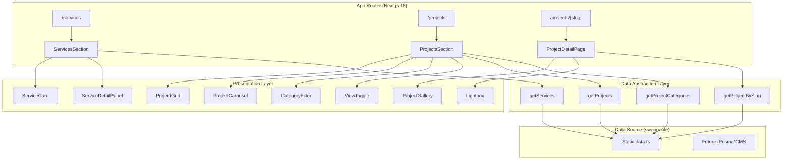

# Design Document: Services & Projects UI Redesign

## Overview

Este diseño transforma las secciones de Servicios y Proyectos del portafolio de Juan Carlos Echeverri Avalúos desde una implementación básica (tarjetas shadcn/ui genéricas + carrusel embla simple + diálogo HeadlessUI) hacia una experiencia visual moderna con animaciones Framer Motion, filtrado de proyectos, vistas alternativas (grid/carrusel), páginas de detalle dedicadas con URLs slug-based, y un lightbox profesional con zoom y navegación por teclado/swipe.

### Decisiones Clave de Diseño

1. **Framer Motion como motor de animación único**: Reemplaza cualquier animación CSS ad-hoc y react-reveal. Proporciona `AnimatePresence` para transiciones de layout al filtrar, `motion.div` para entradas escalonadas, y `useReducedMotion` para accesibilidad.

2. **Capa de abstracción de datos (Repository Pattern)**: Funciones async (`getServices()`, `getProjects()`, `getProjectBySlug()`) que encapsulan la fuente de datos. Hoy leen del archivo estático; mañana pueden leer de Prisma/CMS sin cambiar componentes.

3. **Páginas de detalle con App Router**: Ruta dinámica `src/app/projects/[slug]/page.tsx` con `generateStaticParams` para SSG. Elimina la dependencia del modal como única forma de ver detalles.

4. **Radix UI Dialog para modales/lightbox**: Mantiene consistencia con el stack actual (ya usa `@radix-ui/react-dialog`). Proporciona focus trap, ARIA roles, y portal rendering nativamente.

5. **embla-carousel estable para carrusel**: Se mantiene embla-carousel (ya instalado v8.5.1) con plugins de autoplay. No se introduce nueva dependencia de carrusel.

## Architecture



### Estructura de Archivos Propuesta

```
src/
├── app/
│   ├── projects/
│   │   ├── page.tsx              # Lista de proyectos (grid/carrusel + filtros)
│   │   └── [slug]/
│   │       └── page.tsx          # Detalle de proyecto individual
│   └── services/
│       └── page.tsx              # Sección de servicios (existente, se actualiza)
├── components/
│   ├── services/
│   │   ├── service-card.tsx      # Tarjeta individual con acento de color
│   │   ├── service-detail-panel.tsx  # Modal de detalle enriquecido
│   │   └── services-section.tsx  # Contenedor con animaciones
│   ├── projects/
│   │   ├── project-card.tsx      # Tarjeta con overlay hover
│   │   ├── project-grid.tsx      # Vista grid con AnimatePresence
│   │   ├── project-carousel.tsx  # Vista carrusel (embla)
│   │   ├── category-filter.tsx   # Filtros por categoría
│   │   ├── view-toggle.tsx       # Toggle grid/carrusel
│   │   ├── project-gallery.tsx   # Grid de thumbnails
│   │   ├── lightbox.tsx          # Lightbox con zoom/nav/swipe
│   │   └── projects-section.tsx  # Contenedor orquestador
│   └── ui/                       # shadcn/ui (existente)
├── lib/
│   ├── data/
│   │   ├── services.ts           # getServices(), interfaz Service
│   │   ├── projects.ts           # getProjects(), getProjectBySlug(), etc.
│   │   └── types.ts              # Interfaces compartidas
│   └── utils.ts                  # Utilidades (slugify, etc.)
└── hooks/
    ├── use-reduced-motion.ts     # Hook para prefers-reduced-motion
    └── use-lightbox.ts           # Estado del lightbox
```

## Components and Interfaces

### ServiceCard

```typescript
interface ServiceCardProps {
  service: Service;
  index: number;          // Para delay de animación escalonada
  accentColor: string;    // Color único por servicio
}
```

Componente presentacional que renderiza una tarjeta con:
- Ícono SVG del servicio con fondo del color de acento
- Título y descripción (truncada a 120 chars)
- Botón "Saber más" que abre el ServiceDetailPanel
- Animación de entrada con `motion.div` (fadeIn + translateY)
- Hover: elevación (translateY -4px) + sombra incrementada + scale 1.03
- En touch devices: muestra toda la info sin depender de hover

### ServiceDetailPanel

```typescript
interface ServiceDetailPanelProps {
  service: Service;
  isOpen: boolean;
  onClose: () => void;
  triggerRef: React.RefObject<HTMLButtonElement>;  // Para devolver foco
}
```

Modal basado en Radix Dialog con:
- Encabezado: ícono + título grande
- Cuerpo: descripción con jerarquía tipográfica (h3 secciones, p cuerpo)
- Categorías renderizadas como badges/chips individuales
- Focus trap nativo de Radix
- Cierre con Escape, click fuera, o botón X
- Animación de entrada/salida con Framer Motion (scale + opacity)

### ProjectCard

```typescript
interface ProjectCardProps {
  project: Project;
  index: number;
  priority?: boolean;     // Para LCP - primeras imágenes sin lazy
}
```

Tarjeta con:
- Next.js Image con aspect-ratio 4:3, blur placeholder, sizes responsive
- Overlay con gradiente en hover: título + ubicación + "Ver proyecto"
- En touch: overlay permanente con info visible
- Link a `/projects/[slug]`

### ProjectGrid

```typescript
interface ProjectGridProps {
  projects: Project[];
}
```

Grid responsivo con `AnimatePresence` + `motion.div` layout para transiciones al filtrar. Usa `LayoutGroup` para animaciones de reordenamiento suaves.

### ProjectCarousel

```typescript
interface ProjectCarouselProps {
  projects: Project[];
}
```

Wrapper sobre embla-carousel-react con:
- Loop infinito, autoplay 5000ms
- Pausa en hover/touch/controles, reanuda tras 3000ms inactividad
- Slides responsivos: 1/2/2.5 visibles según breakpoint
- Indicadores de progreso (dots)
- Controles prev/next en desktop
- Swipe nativo (embla lo maneja, threshold 30px)
- Navegación con flechas de teclado

### CategoryFilter

```typescript
interface CategoryFilterProps {
  categories: string[];
  activeCategory: string;
  onCategoryChange: (category: string) => void;
}
```

Barra de filtros con:
- Botón "Todos" + botones por cada categoría única
- Estilo activo diferenciado (fondo sólido vs outline)
- Animación de indicador activo con `motion.div` layoutId

### ViewToggle

```typescript
interface ViewToggleProps {
  activeView: 'grid' | 'carousel';
  onViewChange: (view: 'grid' | 'carousel') => void;
}
```

Toggle con íconos grid/carousel, indicador visual del modo activo.

### Lightbox

```typescript
interface LightboxProps {
  images: string[];
  initialIndex: number;
  isOpen: boolean;
  onClose: () => void;
}
```

Componente fullscreen con:
- Navegación: flechas teclado, botones prev/next, swipe touch
- Zoom: pinch (touch) o scroll (desktop), 1x-3x, reset al navegar
- Indicador "N de M"
- Botón cierre 44x44px mínimo
- Focus trap + scroll lock del body
- Animación expansión/contracción desde thumbnail

### ProjectGallery

```typescript
interface ProjectGalleryProps {
  images: string[];
}
```

Grid de thumbnails (2/3/4 cols responsive) con lazy loading. Click abre Lightbox en la imagen seleccionada.

### ProjectsSection (Orquestador)

```typescript
interface ProjectsSectionProps {
  initialProjects: Project[];
  categories: string[];
}
```

Componente client que maneja:
- Estado de vista activa (grid/carousel)
- Estado de categoría activa
- Filtrado de proyectos
- Renderiza ViewToggle + CategoryFilter + (ProjectGrid | ProjectCarousel)

## Data Models

### Interfaces Actualizadas

```typescript
// src/lib/data/types.ts

export interface Project {
  slug: string;              // URL-friendly identifier (generado desde título)
  title: string;             // Máximo 200 caracteres
  description: string;       // Máximo 2000 caracteres
  images: string[];          // Rutas de imagen, 1-20 elementos
  category: string;          // Máximo 100 caracteres (Fincas, Hoteles, etc.)
  location: string;          // Máximo 100 caracteres (ciudad/región)
  date: string;              // ISO 8601 format
  // Campos opcionales futuros no rompen componentes existentes
  [key: string]: unknown;
}

export interface Service {
  title: string;             // Máximo 200 caracteres
  description: string;       // Máximo 500 caracteres
  details: string;           // Máximo 5000 caracteres (puede incluir listas)
  icon: string;              // Ruta al recurso SVG
  accentColor: string;       // Valor CSS válido (hex, hsl, etc.)
}
```

### Capa de Abstracción de Datos

```typescript
// src/lib/data/services.ts
export async function getServices(): Promise<Service[]> {
  // Hoy: lee de archivo estático
  // Mañana: lee de Prisma/CMS
  return staticServices;
}

// src/lib/data/projects.ts
export async function getProjects(): Promise<Project[]> {
  return staticProjects;
}

export async function getProjectBySlug(slug: string): Promise<Project | null> {
  const projects = await getProjects();
  return projects.find(p => p.slug === slug) ?? null;
}

export async function getProjectCategories(): Promise<string[]> {
  const projects = await getProjects();
  const categories = [...new Set(projects.map(p => p.category).filter(Boolean))];
  return categories;
}
```

### Migración de Datos Existentes

Los datos actuales en `data.ts` se migran agregando los campos nuevos:

```typescript
// Ejemplo de proyecto migrado
{
  slug: "fincas-ganaderas-cimitarra",
  title: "Fincas Ganaderas Cimitarra",
  description: "Hemos llevado a cabo avalúos de fincas ganaderas...",
  images: ["/images/cimitarra/img_1.jpg", ...],
  category: "Fincas",
  location: "Cimitarra, Santander",
  date: "2023-01-15"
}

// Ejemplo de servicio migrado
{
  title: "Avalúos",
  description: "Realizamos avalúos comerciales...",
  details: "Ofrecemos servicios de avalúo en todas las categorías...",
  icon: "/icons/house_rent.svg",
  accentColor: "#4A7C59"  // Verde para avalúos
}
```

### Función Slugify

```typescript
// src/lib/utils.ts
export function slugify(text: string): string {
  return text
    .toLowerCase()
    .normalize('NFD')
    .replace(/[\u0300-\u036f]/g, '')  // Elimina acentos
    .replace(/[^a-z0-9]+/g, '-')
    .replace(/(^-|-$)/g, '');
}
```

## Correctness Properties

*A property is a characteristic or behavior that should hold true across all valid executions of a system—essentially, a formal statement about what the system should do. Properties serve as the bridge between human-readable specifications and machine-verifiable correctness guarantees.*

### Property 1: Unique Accent Colors

*For any* collection of services rendered in the Sección_Servicios, all `accentColor` values must be pairwise distinct—no two services share the same accent color string.

**Validates: Requirements 1.5**

### Property 2: Category Filter Generation

*For any* set of projects with category fields, the generated filter options shall equal exactly the set of unique, non-empty category values present in the data, plus a "Todos" option. No category present in the data is omitted, and no category absent from the data is included.

**Validates: Requirements 5.1, 10.5**

### Property 3: Category Filtering Correctness

*For any* set of projects and any selected category (other than "Todos"), the filtered result shall contain exactly those projects whose `category` field equals the selected category. When "Todos" is selected, all projects are returned unfiltered.

**Validates: Requirements 5.3**

### Property 4: Slug Generation URL-Safety

*For any* non-empty project title string (including strings with accented characters, special characters, spaces, and mixed case), the generated slug shall: (a) contain only lowercase ASCII letters, digits, and hyphens, (b) not start or end with a hyphen, and (c) not contain consecutive hyphens.

**Validates: Requirements 6.1**

### Property 5: Boundary Navigation Disabling

*For any* ordered list of items (projects or gallery images) of length N and any current index i (0 ≤ i < N): the "previous" navigation shall be disabled if and only if i == 0, and the "next" navigation shall be disabled if and only if i == N-1.

**Validates: Requirements 6.3, 7.3**

### Property 6: SEO Metadata Derivation

*For any* project with a non-empty title and description, the generated page metadata shall produce a `title` that contains the project's title string, and a `description` that is derived from (contains or is a truncation of) the project's description.

**Validates: Requirements 6.5**

### Property 7: Zoom Level Clamping

*For any* zoom input value (from pinch gesture delta or scroll delta), the resulting zoom level shall be clamped to the range [1.0, 3.0]. Additionally, *for any* navigation action to a different image while the lightbox is open, the zoom level shall reset to exactly 1.0.

**Validates: Requirements 7.4**

### Property 8: Forward-Compatible Rendering

*For any* valid project object that includes additional unknown fields beyond the defined interface (simulating future CMS fields), the rendering components shall produce output without throwing errors, and shall correctly render all known fields that are present.

**Validates: Requirements 10.2**

### Property 9: Data Model Validation

*For any* valid Project object: `title.length` ≤ 200, `description.length` ≤ 2000, `images.length` ∈ [1, 20], `category.length` ≤ 100, `location.length` ≤ 100, and `date` matches ISO 8601 format. *For any* valid Service object: `title.length` ≤ 200, `description.length` ≤ 500, `details.length` ≤ 5000, `icon` ends with `.svg`, and `accentColor` is a non-empty string.

**Validates: Requirements 10.3, 10.4**

## Error Handling

### Capa de Datos

| Escenario | Comportamiento |
|-----------|---------------|
| `getServices()` retorna array vacío | Sección_Servicios muestra estado vacío con mensaje informativo |
| `getProjects()` retorna array vacío | Sección_Proyectos muestra estado vacío, filtros ocultos |
| `getProjectBySlug()` retorna `null` | Página retorna `notFound()` → Next.js muestra 404 |
| Imagen no carga (404/error de red) | Next.js Image muestra placeholder de blur indefinidamente; no rompe layout |
| Categoría sin proyectos | Grid/Carrusel muestra mensaje "No hay proyectos en esta categoría" |

### Componentes UI

| Escenario | Comportamiento |
|-----------|---------------|
| Lightbox con array de imágenes vacío | No se abre; botón de abrir deshabilitado |
| Proyecto sin campo `location` | Tarjeta omite la línea de ubicación sin romper layout |
| Proyecto sin campo `category` | Proyecto aparece solo en vista "Todos", no en filtros específicos |
| Error en animación Framer Motion | Componente renderiza en estado final sin animación (graceful degradation) |
| Slug duplicado en datos | `getProjectBySlug` retorna el primer match; se valida unicidad en migración |

### Estrategia de Error Boundaries

```typescript
// Wrapper para secciones principales
<ErrorBoundary fallback={<SectionEmptyState message="Error cargando contenido" />}>
  <ServicesSection />
</ErrorBoundary>
```

## Testing Strategy

### Enfoque Dual: Unit Tests + Property Tests

**Unit Tests (ejemplo-based):**
- Rendering de componentes individuales (ServiceCard, ProjectCard, Lightbox)
- Interacciones de usuario (hover, click, keyboard navigation)
- Accesibilidad (ARIA roles, focus trap, keyboard operability)
- Responsive layout verification
- Animation trigger behavior (viewport entry, reduced motion)
- Edge cases (empty data, missing fields, 404 pages)

**Property Tests (universal properties):**
- Librería: [fast-check](https://github.com/dubzzz/fast-check) (TypeScript-native, excelente integración con Vitest/Jest)
- Mínimo 100 iteraciones por propiedad
- Cada test referencia su propiedad del diseño con tag:
  ```
  // Feature: services-projects-ui-redesign, Property 4: Slug Generation URL-Safety
  ```

### Configuración de Property Tests

```typescript
import fc from 'fast-check';

// Generadores personalizados
const projectTitleArb = fc.string({ minLength: 1, maxLength: 200 });
const spanishTextArb = fc.stringOf(
  fc.oneof(fc.char(), fc.constantFrom('á','é','í','ó','ú','ñ','ü',' ','-'))
);
const categoryArb = fc.string({ minLength: 1, maxLength: 100 });
const projectArb = fc.record({
  slug: fc.string(),
  title: fc.string({ minLength: 1, maxLength: 200 }),
  description: fc.string({ maxLength: 2000 }),
  images: fc.array(fc.string({ minLength: 1 }), { minLength: 1, maxLength: 20 }),
  category: categoryArb,
  location: fc.string({ maxLength: 100 }),
  date: fc.date().map(d => d.toISOString().split('T')[0]),
});
```

### Propiedades a Implementar

| Property | Test File | Función Bajo Test |
|----------|-----------|-------------------|
| 1: Unique Accent Colors | `services.property.test.ts` | Validación de datos de servicios |
| 2: Category Filter Generation | `projects-filter.property.test.ts` | `getProjectCategories()` |
| 3: Category Filtering Correctness | `projects-filter.property.test.ts` | `filterProjects(projects, category)` |
| 4: Slug Generation URL-Safety | `slugify.property.test.ts` | `slugify()` |
| 5: Boundary Navigation | `navigation.property.test.ts` | `getNavigationState(index, total)` |
| 6: SEO Metadata Derivation | `metadata.property.test.ts` | `generateProjectMetadata(project)` |
| 7: Zoom Level Clamping | `lightbox.property.test.ts` | `clampZoom()`, `handleNavigate()` |
| 8: Forward-Compatible Rendering | `rendering.property.test.ts` | Component render con datos extendidos |
| 9: Data Model Validation | `data-validation.property.test.ts` | `validateProject()`, `validateService()` |

### Integration Tests

- Navegación completa: lista → detalle → back
- Filtrado + cambio de vista (grid ↔ carrusel)
- Lightbox: abrir → navegar → zoom → cerrar
- Performance: Lighthouse CI para LCP ≤ 2.5s

### Herramientas

- **Test Runner**: Vitest (compatible con Next.js, fast-check integra nativamente)
- **Component Testing**: React Testing Library
- **Property Testing**: fast-check
- **E2E** (opcional futuro): Playwright para flujos completos
- **Performance**: Lighthouse CI en pipeline

